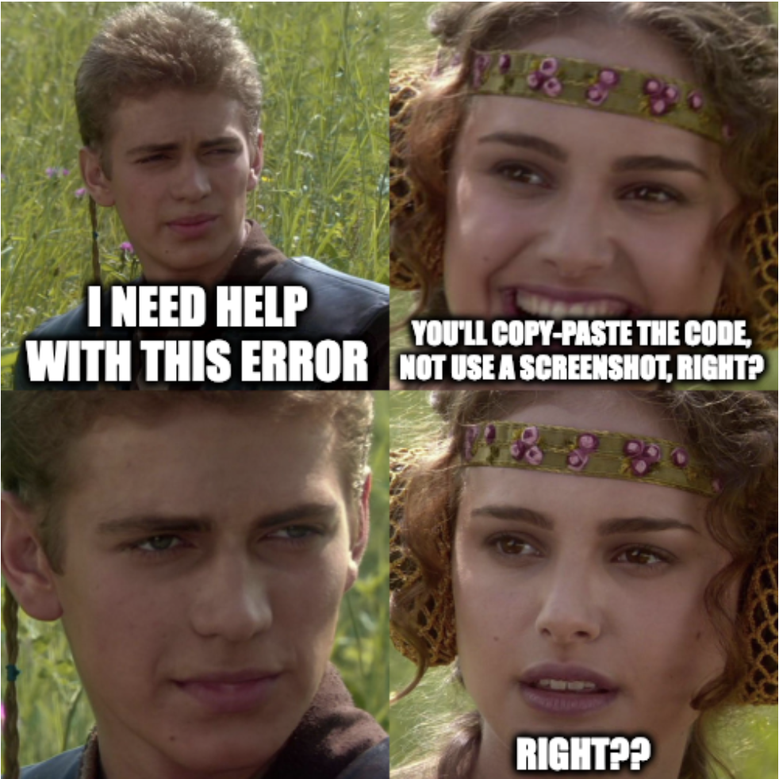
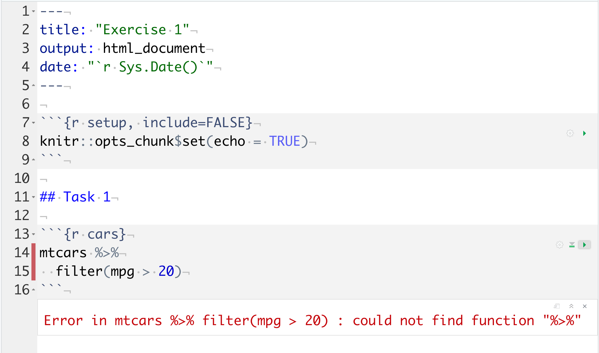
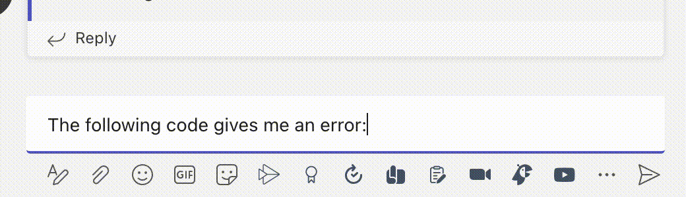
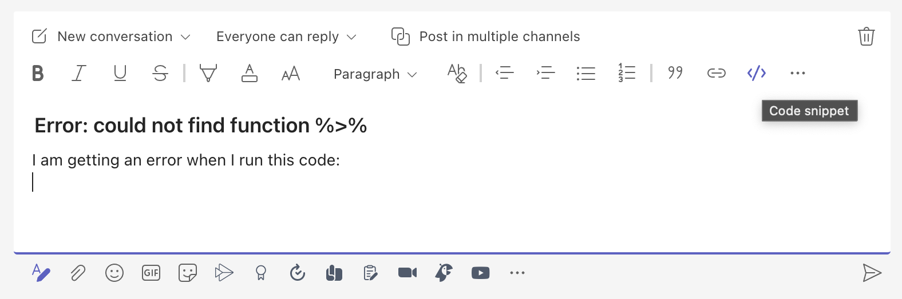
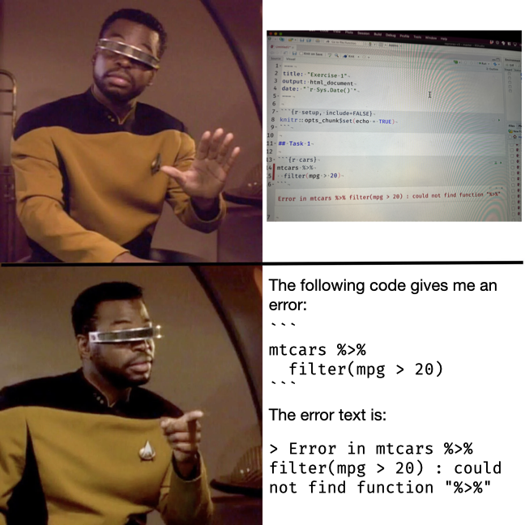

# Getting Help {#getting-help}

## What is the best way to share R code?

<div class="meme right"></div>

You have run into a problem and need to get help on a forum like our class MS Teams channel. What is the right way to share your code?

Please do *not* share a screenshot unless you are asked, or if it is not the code that is giving you problems, but something weird is happening with the RStudio IDE.

If it's your code that is not working, it is almost always better to copy and paste the code, because then people who are trying to help you can copy and paste the code *exactly* to try it out, rather than having to re-type everything from the image. Let's look at an example. Below is a screenshot of how the RStudio IDE might look when your code throws an error. Here the code block labelled `cars` is causing the error.

```{r, echo = FALSE}
#| fig.cap: A screenshot of the RStudio IDE showing an error in red.

```


The particular error that our code threw was

    Error in mtcars %>% filter(mpg > 20) : could not find function "%>%"

And the code that threw it was

```{r cars, echo = TRUE, eval = FALSE}
mtcars %>%
  filter(mpg > 20)
```

Note that you can select and copy the code above if you wanted to run it yourself, but you could not do that if all you had to rely on was the screenshot.

Copying the code and/or error in RStudio is easy; just highlight the code using the mouse and press Ctrl-C.

If you just paste the code into a Teams channel, the formatting is not so nice; you lose the fixed-width formatting that allows you to read the code easily.

Here are two ways to get your code into Teams, one that is quick and easy but not very flexible, and another that is far more flexible but requires more steps.

### Backticks

First, if it is just a short function call, a single line, or an error, you can signal that text is meant to appear as code by surrounding it by single backticks---i.e., putting a backtick (\`) right before and right after the text that you want to be formatted as code. Teams will automatically format it for you.

For multi-line code, the easiest and fastest way is just to type three backticks inside your message at the beginning of a line. Any subsequent text you enter will be treated as code. To get to the beginning of a line without submitting your post, press Ctrl-Enter while typing your message. Then type the three backticks, and paste your code right into the grey box that automatically appears. Press Enter twice in a row to get back out of the code entry box. So your message might look like this.

```{r, echo = FALSE}
#| fig.cap: An animation of the instructions to make code blocks in Teams

```

### Code snippets

Before pasting any text, click on the icon that looks like the letter "A" with a pencil. This will open up options for text formatting and will allow you to easily create a multi-line post. From those options, select the icon that looks like `</>`, which stands for code. 

```{r, echo = FALSE}
#| fig.cap: A screenshot of the Teams editing interface.

```

The code icon will open a window where you can paste your code. In the dropdown menu on the top right, select 'R' as the type of code. This will give you syntax highlighting. 

## Reprex

You might see people in coding forums like StackOverflow asking for a "reprex", or a reproducible example. This is the smallest, completely self-contained example of your problem or question. 

For example, you may have a question about how to figure out how to select rows that contain the value "test" in a certain column, but it isn't working. It's clearer if you can provide a concrete example, but you don't want to have to type out the whole table you're using or all the code that got you to this point in your script. 

You can include a very small table with just the basics or a smaller version of your problem. Make comments at each step about what you expect and what you actually got. 

Which version is easier for you to figure out the solution?

```{r, eval = FALSE}
# this doesn't work
no_test_data <- data |>
  filter(!str_detect(type, "test"))
```

... OR ...


```{r, eval = FALSE}
library(tidyverse)

# with a minimal example table
data <- tribble(
  ~id, ~type, ~x,
  1, "test", 12,
  2, "testosterone", 15,
  3, "estrogen", 10
)

# this should keep IDs 2 and 3, but removes ID 2
no_test_data <- data |>
  filter(!str_detect(type, "test"))

# expected to be true
all(no_test_data$type == c("testosterone", "estrogen"))
```

One of the big benefits to creating a reprex is that you often solve your own problem while you're trying to break it down to explain to someone else.

If you really want to go down the rabbit hole, you can create a reproducible example using the [reprex](https://www.tidyverse.org/help/#reprex) package from tidyverse.

## Screenshots

<div class="meme right" style="min-width:60%;></div>

If you do need to take a screenshot, for example, if something goes wrong during installation, please use the screenshot functions built-in to your computer rather than taking a photo of your screen using your phone.

### Taking a screenshot on Windows

* Use the Windows search function to search for "Snip & Sketch"
* Click "New" then "Snip now"
* Use the tool to select the area on the screen you want to take a screenshot of. This photo will automatically be copied to your clipboard, so you can paste it into e.g., a Teams chat or a document using Ctrl + V but you can also click the Save icon in the top right to save the screenshot as an image file.
* The shortcut for the snipping tool is Win + Shift + S.

### Taking a screenshot on Mac

* Press Shift + Command (⌘) + 4 to bring up the Screenshot app.
* Use the tool to select the area on the screen you want to take a screenshot of.
* If you see a thumbnail in the corner of your screen, click it to edit the screenshot or drag it into e.g., a Teams chat.
* This photo will also automatically save to your desktop.
